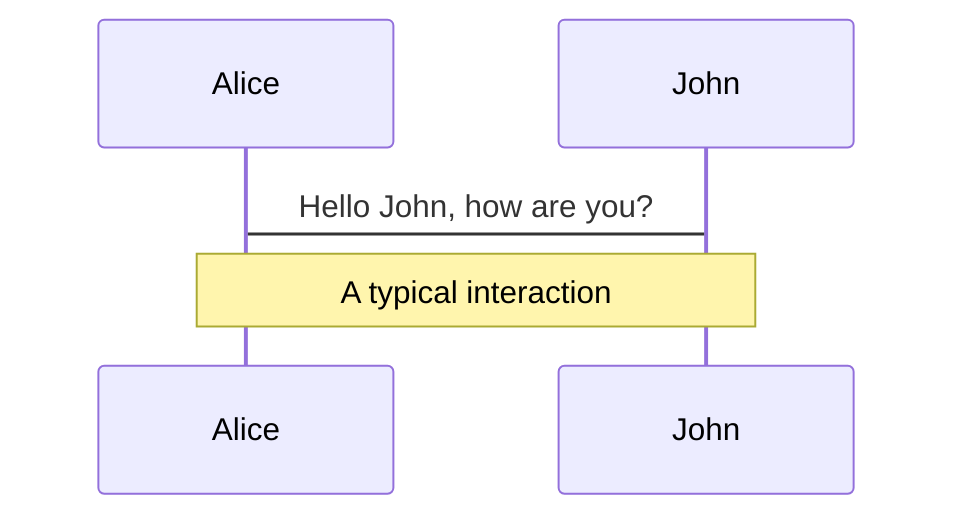
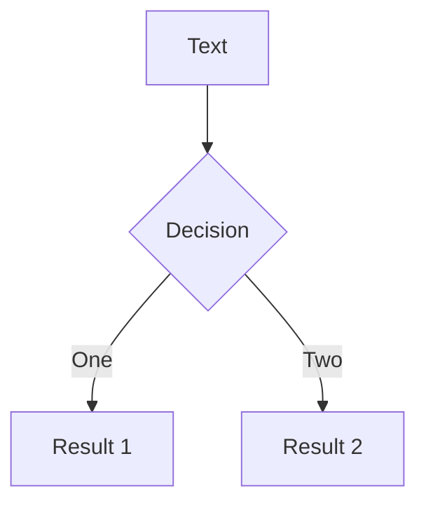
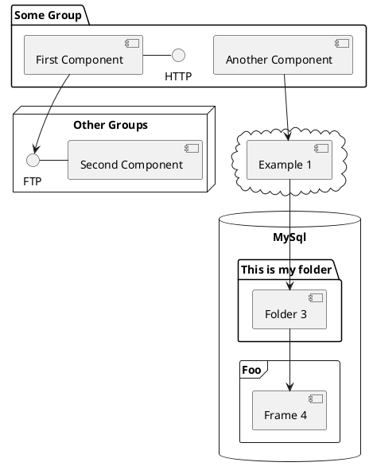

# Modernizing Vue
<br/>
<br/>
Presented With <a href="https://sli.dev/">Slidev</a>

<div class="abs-br m-6 flex gap-2">
  <a href="https://github.com/slidevjs/slidev" target="_blank" alt="GitHub"
    class="text-xl icon-btn opacity-50 !border-none !hover:text-white">
    <carbon-logo-github />
  </a>
</div>

<style>
.slidev-layout.cover {
background-image: linear-gradient(rgba(0, 0, 0, 0.333), rgba(0, 0, 0, 0.983)), url("./assets/img/houston-texas-2609030_1920.jpg");
}
</style>

<!--
The last comment block of each slide will be treated as slide notes. It will be visible and editable in Presenter Mode along with the slide. [Read more in the docs](https://sli.dev/guide/syntax.html#notes)
-->

---
hideInToc: true
---

# Table Of Contents
<Toc columns="2" maxDepth="1" mode="all" />

---
title: Modernizing Vue
layout: two-cols
---

# Vue 3

* <Link to="4">Composition (or Options) API</Link>
* <Link to="5">TypeScript or Modern JS</Link>
* <Link to="6">Pinia</Link>
* <Link to="7">Vite</Link>
* Multiple Apps

::right::

# Vue 2

* Options API
* Modern JS
* Vuex
* Legacy Build Tools
* Single App

<!--
* [Nuxt](https://nuxtjs.org/) 
* [Quasar](https://quasar.dev/)
* [Veutify](https://vuetifyjs.com/en/)[logo]
-->

---
layout: two-cols
level: 2
quote: New API
---

# Composition
```ts {all|1|5|8-10|2|13-15|18-20|1,16,18,20|all}
<script setup>
import { ref, onMounted } from 'vue'

// reactive state
const count = ref(0)

// functions that mutate state and trigger updates
function increment() {
  count.value++
}

// lifecycle hooks
onMounted(() => {
  console.log(`The initial count is ${count.value}.`)
})
</script>

<template>
  <button @click="increment">Count is: {{ count }}</button>
</template>
```
<arrow v-click="2" x1="250" y1="180" x2="480" y2="180" color="#564" width="3" arrowSize="1" />

<arrow v-click="3" x1="260" y1="240" x2="480" y2="270" color="#564" width="3" arrowSize="1" />

<arrow v-click="5" x1="230" y1="360" x2="480" y2="380" color="#564" width="3" arrowSize="1" />

::right::

# Options API

```ts {}
<script>
export default {
  data() {
    return {
      count: 0
    }
  },

  methods: {
    increment() {
      this.count++
    }
  },

  mounted() {
    console.log(`The initial count is ${this.count}.`)
  }
}
</script>

<template>
  <button @click="increment">Count is: {{ count }}</button>
</template>
```

<!--
Code is cleaner, more approachable, and elegant.

* **<span color="green">&lt;script setup&gt;</span>**
<br/>imports and top-level variables / functions declared in &lt;script setup&gt; are directly usable in the template
  * ( variables )
  * ( methods )

* <span color="green">import</span> things we did not before.
  * onMounted() example

Is everything easier? No, but it doesn't take long to adjust.

* <span color="green">Template</span> code the same

* We do prefer <span color="green">script</span> before <span color="green">template</span>  now.
-->

---
layout: two-cols
---

# TypeScript

::right::

# JarasicScript


<!--
Link to good article.
https://www.sitepoint.com/typescript-vs-javascript/
-->

---
layout: two-cols
---

# Pinia

* Composition API
* DevTools Support (simplified)
* TypeScript Native
* Simpler Code
* [HMR (Hot Module Replacement)](https://pinia.vuejs.org/cookbook/hot-module-replacement.html)

::right::

# Vuex

* Options API
* DevTools Support (mutations)
* TypeScript "possible"
* Functional but Challenging Code

<!--
* HMR
  * state
  * actions
  * getters
  
Pinia supports Hot Module replacement so you can edit your stores and interact with them directly in your app without reloading the page, allowing you to keep the existing state, add, or even remove state, actions, and getters.
-->

---
layout: two-cols
---

# Vite

* Awesome
* [HMR (Hot Module Replacement)](https://pinia.vuejs.org/cookbook/hot-module-replacement.html)

::right::

# Classic Node

* Pretty Good

<!--
* Stuff
  
Who Knew
-->

---

# What is Slidev?

Slidev is a slides maker and presenter designed for developers, consist of the following features

- 📝 **Text-based** - focus on the content with Markdown, and then style them later
- 🎨 **Themable** - theme can be shared and used with npm packages
- 🧑‍💻 **Developer Friendly** - code highlighting, live coding with autocompletion
- 🤹 **Interactive** - embedding Vue components to enhance your expressions
- 🎥 **Recording** - built-in recording and camera view
- 📤 **Portable** - export into PDF, PNGs, or even a hostable SPA
- 🛠 **Hackable** - anything possible on a webpage

<br>
<br>

Read more about [Why Slidev?](https://sli.dev/guide/why)

<!--
You can have `style` tag in markdown to override the style for the current page.
Learn more: https://sli.dev/guide/syntax#embedded-styles
-->

<style>
h1 {
  background-color: #2B90B6;
  background-image: linear-gradient(45deg, #4EC5D4 10%, #146b8c 20%);
  background-size: 100%;
  -webkit-background-clip: text;
  -moz-background-clip: text;
  -webkit-text-fill-color: transparent;
  -moz-text-fill-color: transparent;
}
</style>

---

# Navigation

Hover on the bottom-left corner to see the navigation's controls panel, [learn more](https://sli.dev/guide/navigation.html)

### Keyboard Shortcuts

|     |     |
| --- | --- |
| <kbd>right</kbd> / <kbd>space</kbd>| next animation or slide |
| <kbd>left</kbd>  / <kbd>shift</kbd><kbd>space</kbd> | previous animation or slide |
| <kbd>up</kbd> | previous slide |
| <kbd>down</kbd> | next slide |

<!-- https://sli.dev/guide/animations.html#click-animations -->

<p v-after class="absolute bottom-23 left-45 opacity-30 transform -rotate-10">Here!</p>

---
layout: image-right
image: https://source.unsplash.com/collection/94734566/1920x1080
---

# Code

Use code snippets and get the highlighting directly![^1]

```ts {all|2|1-6|9|all}
interface User {
  id: number
  firstName: string
  lastName: string
  role: string
}

function updateUser(id: number, update: User) {
  const user = getUser(id)
  const newUser = { ...user, ...update }
  saveUser(id, newUser)
}
```

<arrow v-click="3" x1="400" y1="420" x2="230" y2="330" color="#564" width="3" arrowSize="1" />

[^1]: [Learn More](https://sli.dev/guide/syntax.html#line-highlighting)

<style>
.footnotes-sep {
  @apply mt-20 opacity-10;
}
.footnotes {
  @apply text-sm opacity-75;
}
.footnote-backref {
  display: none;
}
</style>

---

# Components

<div grid="~ cols-2 gap-4">
<div>

You can use Vue components directly inside your slides.

We have provided a few built-in components like `<Tweet/>` and `<Youtube/>` that you can use directly. And adding your custom components is also super easy.

```html
<Counter :count="10" />
```

<!-- ./components/Counter.vue -->
<Counter :count="10" m="t-4" />

Check out [the guides](https://sli.dev/builtin/components.html) for more.

</div>
<div>

```html
<Tweet id="1390115482657726468" />
```

<Tweet id="1390115482657726468" scale="0.65" />

</div>
</div>


---
class: px-20
---

# Themes

Slidev comes with powerful theming support. Themes can provide styles, layouts, components, or even configurations for tools. Switching between themes by just **one edit** in your frontmatter:

<div grid="~ cols-2 gap-2" m="-t-2">

```yaml
---
theme: default
---
```

```yaml
---
theme: seriph
---
```


</div>

Read more about [How to use a theme](https://sli.dev/themes/use.html) and
check out the [Awesome Themes Gallery](https://sli.dev/themes/gallery.html).

---
preload: false
---

# Animations

Animations are powered by [@vueuse/motion](https://motion.vueuse.org/).

```html
<div
  v-motion
  :initial="{ x: -80 }"
  :enter="{ x: 0 }">
  Slidev
</div>
```

<div class="w-60 relative mt-6">
  <div class="relative w-40 h-40">
    
    
    
  </div>

  <div
    class="text-5xl absolute top-14 left-40 text-[#2B90B6] -z-1"
    v-motion
    :initial="{ x: -80, opacity: 0}"
    :enter="{ x: 0, opacity: 1, transition: { delay: 2000, duration: 1000 } }">
    Slidev
  </div>
</div>

<!-- vue script setup scripts can be directly used in markdown, and will only affects current page -->
<script setup lang="ts">
const final = {
  x: 0,
  y: 0,
  rotate: 0,
  scale: 1,
  transition: {
    type: 'spring',
    damping: 10,
    stiffness: 20,
    mass: 2
  }
}
</script>

<div
  v-motion
  :initial="{ x:35, y: 40, opacity: 0}"
  :enter="{ y: 0, opacity: 1, transition: { delay: 3500 } }">

[Learn More](https://sli.dev/guide/animations.html#motion)

</div>

---

# LaTeX

LaTeX is supported out-of-box powered by [KaTeX](https://katex.org/).

<br>

Inline $\sqrt{3x-1}+(1+x)^2$

Block
$$
\begin{array}{c}

\nabla \times \vec{\mathbf{B}} -\, \frac1c\, \frac{\partial\vec{\mathbf{E}}}{\partial t} &
= \frac{4\pi}{c}\vec{\mathbf{j}}    \nabla \cdot \vec{\mathbf{E}} & = 4 \pi \rho \\

\nabla \times \vec{\mathbf{E}}\, +\, \frac1c\, \frac{\partial\vec{\mathbf{B}}}{\partial t} & = \vec{\mathbf{0}} \\

\nabla \cdot \vec{\mathbf{B}} & = 0

\end{array}
$$

<br>

[Learn more](https://sli.dev/guide/syntax#latex)

---

# Diagrams

You can create diagrams / graphs from textual descriptions, directly in your Markdown.

<div class="grid grid-cols-3 gap-10 pt-4 -mb-6">







</div>

[Learn More](https://sli.dev/guide/syntax.html#diagrams)


---
layout: center
class: text-center
---

# Learn More

[Documentations](https://sli.dev) · [GitHub](https://github.com/slidevjs/slidev) · [Showcases](https://sli.dev/showcases.html)
